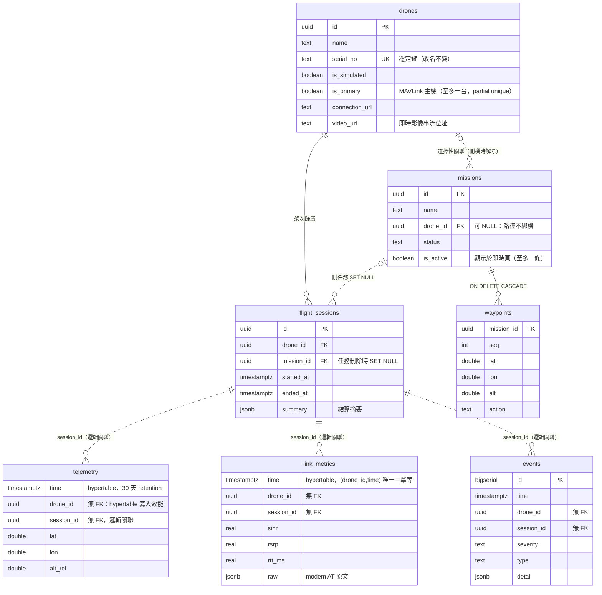

# 系統架構

## 研究目標

無人機經 **5G 通訊**，研究**飛入高干擾場域時對訊號品質的影響**。
系統的核心工作是記錄並視覺化「飛行遙測 × 5G 鏈路品質 × 空間位置」的關聯。

## 整體架構

```
PX4 SITL (Gazebo)          Backend (FastAPI)               Frontend (Next.js)
┌────────────┐  MAVLink  ┌─────────────────────┐  WS/REST  ┌──────────────┐
│  模擬飛控   │ ────────→ │ MAVSDK ingest        │ ────────→ │ 地圖監控 UI   │
│ udp:14540  │           │ 5G link source       │           │ SINR 上色軌跡 │
└────────────┘           │ WS broadcast (5Hz)   │           │ 5G 儀表板     │
                         │ DB writer (1Hz)      │           └──────────────┘
                         └────────┬────────────┘
                         PostgreSQL + TimescaleDB
```

## 核心設計原則

**即時資料流與業務資料分離。**

- Telemetry 流：無人機 → backend → WebSocket 直接推前端（5Hz），同時非同步入庫（1Hz）。
  前端顯示不等資料庫。
- 業務資料（任務、機隊、干擾區設定）走 REST + 關聯式資料表。

## 關鍵決策與理由

### 單機起步、保留多機擴充

- 所有資料表從第一天就帶 `drone_id`。
- MAVSDK ingest 目前是 FastAPI 內的 asyncio 背景任務（`apps/backend/app/ingest.py`），
  **不架 MQTT broker**。
- 多機化路徑：把 ingest 抽成獨立 gateway process、中間插 MQTT、
  `app/state.py` 的單例 `LiveState` 換成 `dict[drone_id, LiveState]`。
  Schema 與前端不用動。

### 5G 鏈路來源可抽換（SITL ↔ 真機）

SITL 沒有真的 5G modem，因此鏈路品質來源抽象成同一個 `sample(lat, lon, alt) -> dict` 介面：

| 階段 | 實作 | 說明 |
|---|---|---|
| 模擬 | `SimulatedLinkSource`（`link_sim.py`）| gNB 距離 → path loss → RSRP → SINR，落在干擾區內額外扣 `severity_db`（區緣漸變）；RTT/丟包/吞吐由 SINR 推導 |
| 真機 | `ModemLinkSource`（未實作）| modem AT command / QMI 讀 RF 指標 + ping 實測 RTT/丟包 |

模擬模型刻意簡單——重點是讓「位置 → 訊號品質」的因果關係**可控、可重現**，
方便開發與驗證前端／分析流程，不是要精確模擬電波傳播。

### 架次（session）為資料組織單位

armed → disarmed 為一個 `flight_session`。所有 telemetry 與 link_metrics 掛在
session 下，「回放某次飛行」「比較兩次實驗」都是一個 `session_id` 條件。
架次結束時自動統計鏈路摘要（avg/min SINR、干擾區內取樣數等）寫入 `summary`。

### 鏈路事件門檻（`apps/backend/app/config.py`）

鏈路狀態是 **ok / degraded / lost 三態機**（`main.py:_link_transition`）。
SINR 是連續量、事件是離散點，直接比大小會在干擾區內每秒發一筆重複事件，
因此只在跨級的當下發一次。

| 轉換 | 條件 | 事件 | severity |
|---|---|---|---|
| → `lost` | SINR < -2 dB | `link_lost` | critical |
| `ok` → `degraded` | SINR < 5 dB | `link_degraded` | warning |
| `lost` → `degraded` | SINR ≥ 1 dB（-2 +3 遲滯）且 < 5 dB | `link_degraded` | warning |
| → `ok` | SINR ≥ 8 dB（5 +3 遲滯）| `link_recovered` | info |

**不發 handover 事件。** 一台無人機等價於一台 UE，換手由 modem 與網路側自行處理，
應用層（機上 ROS、我們的資料蒐集）既不參與決策也不控制它，因此不在研究範圍內。
服務 cell 仍以 `pci` 欄位記錄在 `link_metrics`——那是 modem 回報的事實，
需要時可從時序資料看出變化，不需要為它建立事件。

回升方向都要多 `sinr_hysteresis_db`（預設 3 dB）才算數，避免 SINR 在門檻附近
抖動時來回發事件。每一次跨級都留紀錄——包含 `lost → degraded` 這種中間轉換——
detail 帶 `from` 欄位，事件序列可完整還原鏈路狀態變化。

刻意**不採用 time-to-trigger**（連續 N 秒才轉換）：那會讓事件時間戳晚於實際
發生時刻，而「位置 ↔ 鏈路劣化」的時間對應正是本研究要看的東西。

> 注意：事件是**衍生資料**。`link_metrics` 已經 1Hz 完整記錄 SINR，
> 事後想用別的門檻重新分析，直接查 `link_metrics` 即可，且能回溯套用到
> 所有歷史架次。事件的角色是即時通知與快速查詢，不是統計的唯一來源。

### 影像串流（第一版不做）

前端已預留 16:9 視窗。之後接 **MediaMTX + WebRTC (WHEP)**，
前端只需把 placeholder 換成 `<video>`，版面不動。

## 系統定位與範圍

本專案是**無人機管理系統**，跑在**地面站（Ubuntu）**上，職責是
**控制資料蒐集與記錄事實**。

```
   無人機（機上跑 ROS）              地面站（Ubuntu）
   ┌──────────────────┐            ┌────────────────────────────┐
   │ 飛控 (PX4)        │  MAVLink   │ 本系統：資料蒐集與記錄        │
   │ ROS               │ ─── 5G ──→ │ QGroundControl：控制與校正   │
   │ 5G modem (= 1 UE) │            └────────────────────────────┘
   └──────────────────┘
```

**明確不在範圍內：**

| 項目 | 理由 |
|---|---|
| 網通架構（gNB 佈建、核網、切片）| 另一條工作線負責。本系統只從 UE 側量測鏈路品質 |
| 通道模擬 / 電波傳播建模 | 本系統記錄事實，不做模擬。`link_sim.py` 純為開發鷹架 |
| 換手決策 | 一台無人機 = 一台 UE，換手由 modem 與網路側處理，應用層不參與 |
| 飛行控制與航線規劃 | QGC 負責（QGC 是包在本系統下的控制元件，見 [qgc-integration.md](qgc-integration.md)）|

**衍生的設計原則：backend 對 MAVLink 只讀不寫。** 資料蒐集端不應該有能力
下達飛行指令——真機階段一個誤送的指令可能造成事故。目前 `ingest.py` 只訂閱
telemetry、`api.py` 不含任何 action 呼叫，符合此原則；日後新增功能時須維持。

> 註：`cells` 表在真機階段的角色會縮小。既然不負責網通架構，我們不擁有 gNB
> 佈建資訊，該表退化為「modem 回報過的 cell」參考資料或直接不用。
>
> **`interference_zones` 同樣只屬於模擬階段**（2026-08-04 釐清）。它是模擬器的
> 輸入——SITL 沒有真的干擾源，需要假設一個座標才算得出劣化的 SINR。
> 真機階段**系統對干擾一無所知，也不假裝知道**：研究的因果方向是
> 「飛過去量，量測資料本身揭露干擾在哪」，不是「已知干擾區去驗證」。
> 因此真機模式下前端不顯示干擾區與 gNB 圖層，`in_interference_zone` 與
> 架次摘要的 `samples_in_zone` 為模擬專用語意（真機為 NULL／不計算）。
> 場域的鏈路品質圖是**研究產出物**：依實測 SINR 上色的軌跡累積而成。

## 部署形態

- 開發：`docker compose up`（TimescaleDB + PX4 SITL headless + backend），
  前端 `npm run dev`。
- SITL 與 backend 用 host network，避免 MAVLink UDP 過 NAT 的問題。
- 真機階段：無人機側 companion computer 經 5G 回傳 MAVLink
  （backend 的 `MAVLINK_URL` 換掉即可），`LINK_SOURCE=modem`。

### 5G 量測資料如何從機上回到地面站

已定案：**機上 ROS node 採樣後以 HTTP POST 送回，分即時與記錄兩條通道。**
完整設計見 **[onboard-telemetry.md](onboard-telemetry.md)**。

關鍵前提是「量測通道就是被量測的通道」——鏈路劣化時回傳管道也一起劣化，
而那正是研究最想看的時刻。因此機上必須有持久化緩衝與斷點續傳，
否則資料會系統性地缺少最差的樣本，統計上有偏。

`SimulatedLinkSource.sample()` 的 pull 介面因此只用於模擬階段；
modem 模式下入庫改由 API endpoint 負責。

機上硬體為 **Qualcomm Flight RB5 5G Platform**（QRB5165 + Quectel RM500Q-GL
modem，預裝 ROS 2 與 PX4）。modem 的 `AT+QENG="servingcell"` 直接回報 SINR，
且欄位與 `link_metrics` 幾乎一對一對應，schema 不需為真機階段修改。

## 資料模型（ERD）

2026-08-10 拆除模擬器專用表（`cells`、`interference_zones`——場景改為
`link_sim.py` 內建常數）後的完整 schema，7 張表＋2 個連續彙總：



補充（不在 ERD 裡的資料面）：

- **連續彙總**：`telemetry_1m`、`link_metrics_1m`（TimescaleDB continuous
  aggregate）——原始 1Hz 資料 30 天清除後永久保留的那份。
- **虛線關聯＝刻意無 FK**：兩張 hypertable 與 events 的 `drone_id`/
  `session_id` 不設外鍵（高頻寫入路徑不做關聯檢查），一致性由寫入端保證
  （armed gate＋`find_session_at` 反查）。
- **MAVLink 原始層（tlog）**不在 DB：`mavcap` volume 檔案，UTC 日切、
  30 天滾動（見 `app/capture.py`）。
